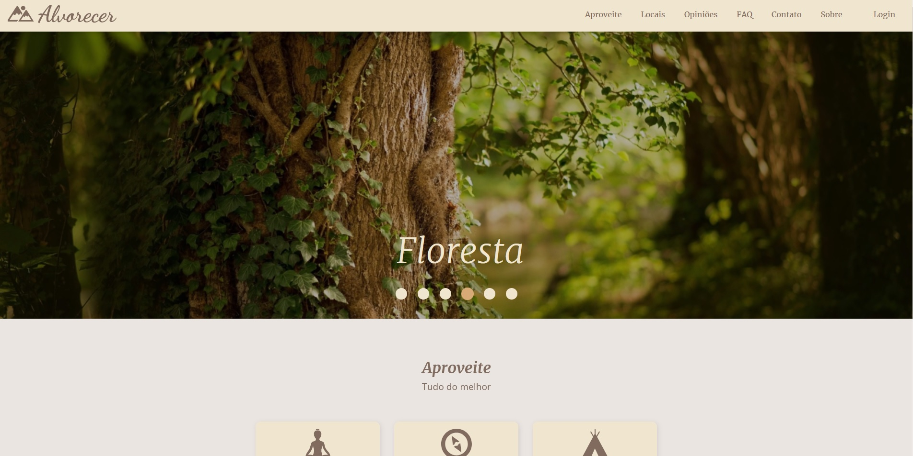
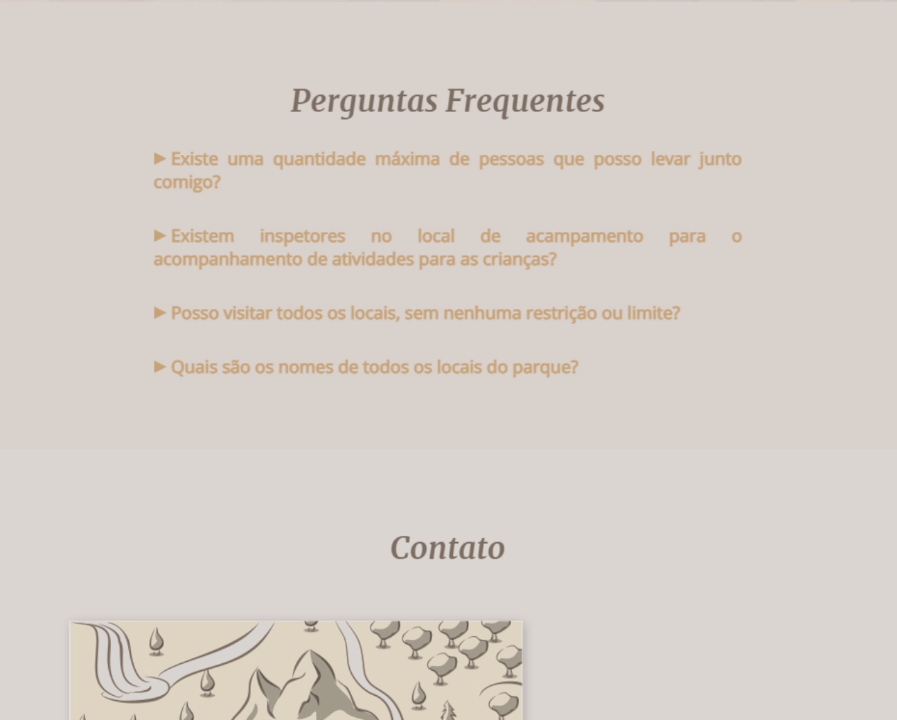
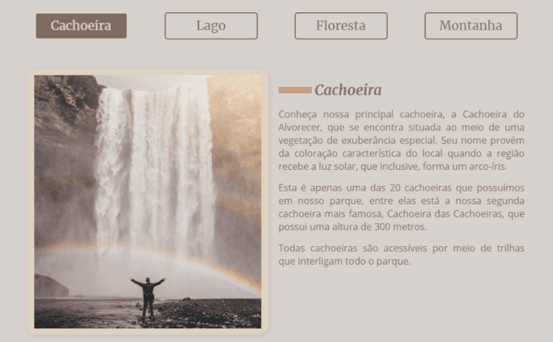
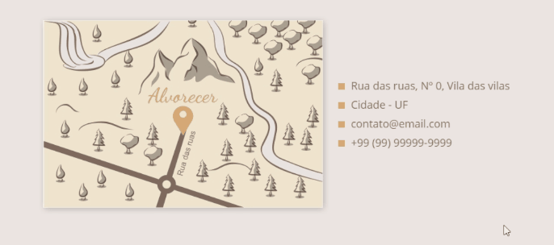

<h1 align="center">
  <br>
  
  <br>
  Alvorecer
</h1>

<h4 align="center">Status: ✔ Concluído</h4>

<p align="center">
  <a href="https://opensource.org/licenses/MIT">
    
  </a>
</p>

<div align="center">
  
</div>

---

<p align="center">
 <a href="#user-content-sobre-o-projeto">Sobre o projeto</a> |
 <a href="#user-content-funcionalidades">Funcionalidades</a> |
 <a href="#user-content-executando-o-projeto">Executando o projeto</a> |
 <a href="#user-content-tecnologias">Tecnologias</a> | 
 <a href="#user-content-licença">Licença</a>
</p>

---

## **Sobre o projeto**

Site desenvolvido para demonstração de conhecimentos adquiridos de HTML, CSS e JavaScript.

## **Funcionalidades**

- [x] Animação ao scroll (conforme é feita a rolagem da página, os itens animam e ocorre a indicação nos itens de menu em qual seção você está)
- [x] Animação de número
- [x] Animação de campo de formulário
- [x] Collapse
- [x] Menu mobile
- [x] Modal
- [x] Navegação em abas
- [x] Scroll suave até o elemento (quando clicado em itens do menu ou na logo)
- [x] Slide
- [x] Tooltip

### Algumas demonstrações
- Animação de número
<div align="center">
  
</div>

- Collapse
<div align="center">
  
</div>

- Modal e Animação de campo de formulário
<div align="center">
  
</div>

- Navegação em abas
<div align="center">
  
</div>

- Tooltip
<div align="center">
  
</div>

## **Executando o projeto**

### Pré-requisitos
Antes de começar, é necessário você já tenha as ferramentas [Node.js](https://nodejs.org/en/) e [Git](https://git-scm.com/) instaladas.

### Instruções de execução do projeto
```bash
# Clone este repositório
$ git clone https://github.com/ViniciusHP/alvorecer.git

# Acesse a pasta deste projeto por meio do terminal
$ cd alvorecer

# Instale as dependências deste projeto
$ npm install

# Execute o projeto em modo de desenvolvimento (servidor + build no modo de desenvolvimento)
$ npm start

# O servidor de desenvolvimento será iniciado na porta 8000
# Para acessar o projeto, navegue para http://localhost:8000

# Se você desejar fazer o build do projeto em modo produção execute:
$ npm run build

# Se você desejar fazer o build do projeto em modo desenvolvimento execute:
$ npm run dev

# Para rodar o servidor:
$ npm run server
```
Para alterar a porta do servidor de desenvolvimento, acesse [bs-config.json](./bs-config.json) e altere o valor de `port` para a porta desejada.

## **Tecnologias**

Este projeto foi construído com as seguintes ferramentas:

- **[JavaScript](https://developer.mozilla.org/pt-BR/docs/Web/JavaScript)**
- **[HTML](https://developer.mozilla.org/pt-BR/docs/Web/HTML)**
- **[CSS](https://developer.mozilla.org/pt-BR/docs/Web/CSS)**
- **[Lite-server](https://github.com/johnpapa/lite-server)**
- **[Babel](https://babeljs.io/)**
- **[Webpack](https://webpack.js.org/)**

## **Licença**

Este projeto esta sobe a licença [MIT](./LICENSE).
